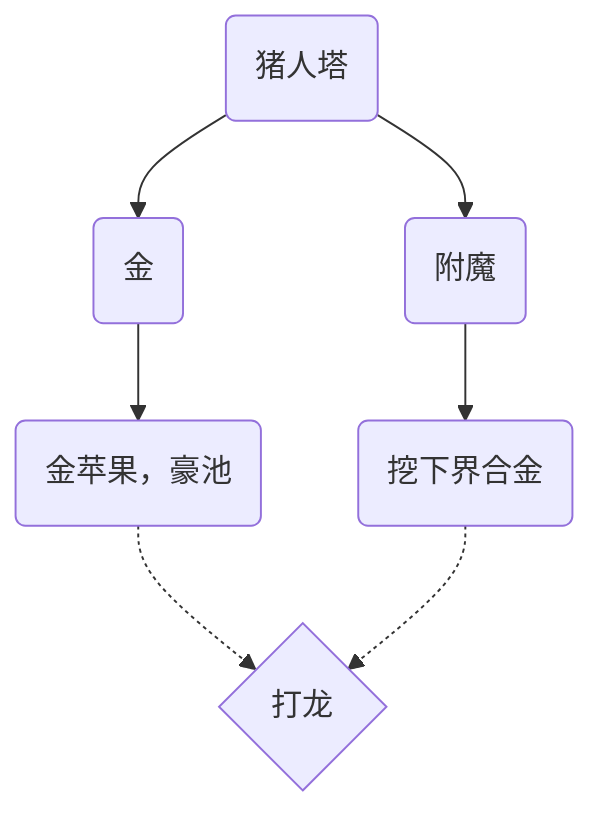

## 2024

### 7.25

豪（）以后在这儿写写日记，记一下要做点什么。

现在做猪人塔，先要刷好多好多冰、树，铺冰道到做猪人塔的区域，同时烧烧玻璃。还有村民繁殖，可以开始做了。

*Flowchart:*



### 7.26

猪人塔，完工！

效率可以，经验自由力

接下来做个简单的史莱姆农场

```text
刷怪平台中心: 870, 234
挂机点: 870, 188, 258
地狱门-主世界: 870, 188, 261
地狱门-下界:   109, 33
```


史莱姆，完工！

挂了一大箱，我这个效率大概4k，真够用了（）

然后开始搞女巫塔！


### 7.27

草，女巫塔的材料怎么都 这 么 多

一早上了材料还没攒够

蚌

```text
女巫塔挂机点地狱门: 148, -35
挂机点: 1184, 190, -285
地狱门-主世界: 1188, 190, -285

```

女巫塔，拿下！

爽！红石自由，爽！

看情况做个岩浆史莱姆农场吧（）（）

该推主线力（）

### 7.29

竹子机（双模式（），树场，爽，自由力

这下看做什么了


